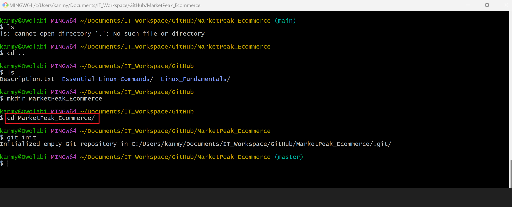
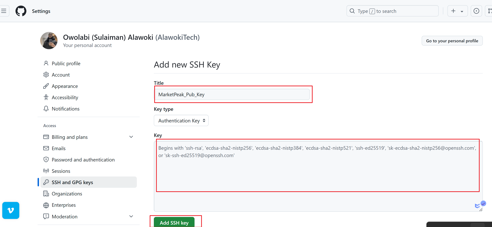

# Introduction to Cloud Computing

## Table of Contents
1. [Introduction](#introduction)
2. [Evaluation Criteria](#evaluation-criteria)
3. [Tasks](#tasks)
    - [1. Git Version Control Setup](#1-git-version-control-setup)
    - [2. Linux Development Environment](#2-linux-development-environment)
    - [3. AWS Deployment](#3-aws-deployment)
    - [4. Capstone Submission](#4-capstone-submission)
    - [5. Overall Project Structure and Clarity](#5-overall-project-structure-and-clarity)
4. [Troubleshooting](#troubleshooting)

## Introduction

In this project, I have been assigned to develop an e-commerce website for a new online marketplace named **MarketPeak**. This platform will feature product listings, a shopping cart, and user authentication. The objective is to utilize Git for version control, develop the platform in a Linux environment, and deploy it on an AWS EC2 instance. To kickstart the development, I have been provided with a suitable website template [link to choose from](https://www.tooplate.com/view/2130-waso-strategy).


### 1. Git Version Control Setup

#### 1.1. Initialize Git Repository
- I created a directory named `MarketPeak_Ecommerce`.
- Inside this directory, i initialize a Git repository to manage your version control.
  ```sh
  mkdir MarketPeak_Ecommerce
  cd MarketPeak_Ecommerce
  git init



#### 1.2. Obtain and Prepare the E-Commerce Website Template
- Download a suitable e-commerce website template from [link to choose from](https://www.tooplate.com/view/2130-waso-strategy).


- Extract the downloaded template into your project directory, `MarketPeak_Ecommerce`.


#### 1.3. Stage and Commit the Template to Git
- Add your website files to the Git repository.
- Set your Git global configuration with your username and email.
- Commit your changes with a clear, descriptive message.
  ```sh
  git add .
  git config --global user.name "YourUsername"
  git config --global user.email "youremail@example.com"
  git commit -m "Initial commit with basic e-commerce site structure"
- 

#### 1.4. Push the code to your Github repository
- Create a remote repository on GitHub named **MarketPeak_Ecommerce.**


- Link your local repository to GitHub and push your code.
  ```sh
  git remote add origin https://github.com/AlawokiTech/MarketPeak_Ecommerce.git
  git push -u origin main/master

- 

## 2. AWS Deployment

### 2.1. Set Up an AWS EC2 Instance
- Log in to the AWS Management Console


- Launch on EC2 instance using Amazon Linus AMI


- Connect to the instance using SSH.


### 2.2. Clone the repository on the Linux Server
Before deploying the e-commerce platform, we need to clone the GitHub repository to the AWS EC2 instance that has been created. This process involves authenticating with GitHub and choosing between two primary methods of cloning a repository: `SSH` and `HTTPS`.
- Navigate to the repository in Github console, select code, select SSH under clone section and copy the SSH link as highlight in the image below


- Clone the remote repository on the Linux Server
    - Below tasks need to be completed before cloning remote repository on the Linux Server
    - Generate SSH keypair using ssh-keygen 

    - To display and copy our public key

    - add the copied SSH public key to our GitHub account
        - Go to GitHub and log in to your account.
        - In the upper-right corner of any page, click your profile photo, then click Settings.
        
        
        - In the user settings sidebar, click SSH and GPG keys.
        
        - Click New SSH key or Add SSH key.
        - In the "Title" field, add a descriptive label for the new key.
        - Paste your key into the "Key" field.
        - Click Add SSH key.
        
        - If prompted, confirm your GitHub password.
        - There is need to install git on the Linux Server if not installed
        
         - Clone our remote repository on the Linux Server
        - `git clone https://github.com/AlawokiTech/MarketPeak_Ecommerce.git`

### 2.3. Install a Web Server on Linux Server (EC2)
To install a web server on the EC2 instance, we will deploy Apache HTTP Server (httpd). Apache is a widely used web server that serves HTML files and content over the internet. Installing it will enable us to host the MarketPeak e-commerce site.

    - sudo yum update -y
    - sudo yum install httpd -y
    - sudo systemctl start httpd
    - sudo systemctl enable httpd

    - sudo yum update -y: This updates the Linux server.
    - sudo yum install httpd -y: This installs httpd (Apache).
    - sudo systemctl start httpd: This starts the web server.
    - sudo systemctl enable httpd: This ensures the web server automatically starts on server boot.

### 2.4. Configure httpd for Website
To be able to serve the website from the EC2 instance, we need to configure the httpd to point to the directory on the linux server where the website code files are stored.

It is usually stored in `var/www/html` directory. This directory is a standard directory structure on Linux systems that host web content, particularly for Apache HTTP Server. Thus directory is automatically created when Apache is installed on the system.

    - sudo rm -rf /var/www/html/*
    - sudo cp -r ~/MarketPeak_Ecommerce/* /var/www/html/
    - sudo systemctl reload httpd

    - sudo rm -rf /var/www/html/*: This forcefully removes all files and directories within the /var/www/html/ directory.
    - sudo cp -r ~/MarketPeak_Ecommerce/* /var/www/html/: This copies all files and directories from the ~/MarketPeak_Ecommerce/ directory to the /var/www/html/ directory.
    - sudo systemctl reload httpd: This reloads the Apache HTTP Server (httpd) configuration without restarting the service.


### 2.4. Access Website from Browser
To confirm that our Server is configured properly and the website files are in place, open a web browser using the Public IP address of your EC2 instance. This will allow you to view the deployed website.


## 3. Continuous Integration and Deployment Workflow
For a smooth workflow in developing, testing, and deploying the e-commerce platform, we will follow the following structured approach. It includes making changes in a development environment, using Git for version control, and deploying updates to our production server on AWS.

### Step 1. Developing new features and fixes
Creating a new branch named `Development Branch` and switched to the branch

    - git branch development
    - git checkout development
I created a new HTML file named `sales.html` and added content to it. Additionally, I updated the navbar in each existing HTML file to include a Sales bar.

Command used: `vi Sales.html`

### Step 2. Version Control with Git.

#### 2.1. **Stage the Changes:** After making changes, add them to the staging area in Git.
   ```sh
   git add .
   ```

#### 2.2. **Commit the Changes:** Save the changes in the Git repository with a commit, including a descriptive message.
   ```sh
   git commit -m "Add new features or fix bugs"
   ```

#### 2.3. **Push Changes to GitHub:** Upload the development branch with the new changes to GitHub.
   ```sh
   git push origin development
   ```


### Step 3. Pull Requests and Merging to the Main branch

#### 3.1. **Create a Pull Request (PR):** On GitHub, create a pull request to merge the development branch into the main branch. This process is crucial for code review and maintaining code quality.

#### 3.2. **Review and Merge the PR:** Review the changes for any potential issues. Once satisfied, merge the pull request into the main branch, incorporating the new features or fixes into the production codebase.

   ```sh
   git checkout main
   git merge development
   ```

#### 3.3. **Push the Merged Changes to GitHub:** Ensure that your local main branch, now containing the updates, is pushed to the remote repository on GitHub.

   ```sh
   git push origin main
   ```


### Step 4. Deploying Updates to the Production Server

#### 4.1. **Pull the Latest Changes on the Server:** SSH into your AWS EC2 instance where the production website is hosted. Navigate to the website's directory and pull the latest changes from the main branch.
   ```sh
   git pull origin main
   ```

#### 4.2. **Restart the Web Server (if necessary):** Depending on the nature of the updates, you may need to restart the web server to apply the changes.
   ```sh
   sudo systemctl reload httpd
   ```

### Step 5. Testing the new changes
- **Access the Website:** Open a web browser and navigate to the public IP address of the EC2 instance. Test the new features or fixes to ensure they work as expected in the live environment.

This workflow emphasizes best practices in software development and deployment, including branch management, code review through pull requests, and continuous integration/deployment strategies. By following these steps, you maintain a stable and up-to-date production environment for your e-commerce platform.